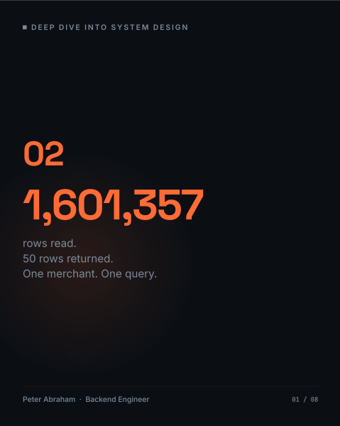
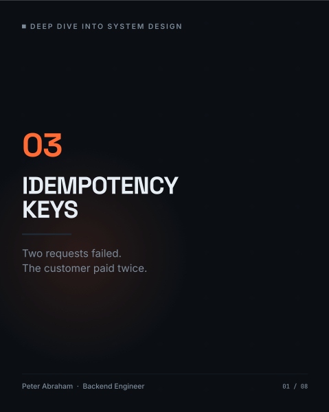

# Paylane

**A multi-tenant payment orchestration platform and double-entry ledger — built in the open as the
companion codebase to the _Deep Dive into System Design_ series.**

Paylane sits between merchants and multiple payment providers (Paystack, Stripe, Monnify): it routes
charges, keeps a balanced double-entry ledger, and — across the series — grows to handle webhooks,
retries, reconciliation and payouts. The code is production-grade Java/Spring. Nothing here is a toy
stub for illustration.

> ### ⚠️ Read this before you judge the code: we build the broken version first, on purpose.
>
> Every topic starts by implementing the **naive, realistic, _wrong_** approach — the one a competent
> engineer would actually write — then runs it, captures the failure as evidence, and **only then**
> fixes it. So if you spot a missing idempotency check, lock, timeout, or index, it may be
> **deliberate**: it is the "before" state a specific post is about.
>
> Every intentional flaw — and the post that removes it — is logged in
> [`docs/DELIBERATE_FLAWS.md`](docs/DELIBERATE_FLAWS.md). Please check there before reporting a "bug." 🙂

---

## 📚 The posts

The series runs on LinkedIn as visual carousels. Click any cover
to open the full slide deck — the PDFs live in [`posts/`](posts/):

<table>
<tr>
<td align="center" width="25%"><a href="posts/post-01-cover.pdf"></a><br><b>01 · Code Is Cheap Now</b><br><sub><i>The consequences aren't.</i></sub></td>
<td align="center" width="25%"><a href="posts/post-02-carousel.pdf"></a><br><b>02 · 1,601,357 Rows Read</b><br><sub><i>50 returned. One query.</i></sub></td>
<td align="center" width="25%"><a href="posts/post-03-carousel.pdf"></a><br><b>03 · Idempotency Keys</b><br><sub><i>The customer paid twice.</i></sub></td>
<td align="center" width="25%"><a href="posts/post-04-carousel.pdf"></a><br><b>04 · The Double-Entry Ledger</b><br><sub><i>They explained nothing.</i></sub></td>
</tr>
</table>

---

## How this repo is organized

The build order follows the post order, and each topic leaves markers so you can see the flaw and the
fix side by side:

- **`master`** — the latest state (currently through post-04).
- **`post-NN`** — a branch pinned to the tip of each topic (`post-01` … `post-04`), for easy reference.
- **`post-NN-before` / `post-NN-after`** — tags marking the naive version vs. the fix, for topics that
  have a distinct before/after (post-03 onward).

To study a topic:

```bash
git checkout post-04-before                 # the naive version
#   …read it, run its repro script under scripts/, watch it fail…
git diff post-04-before post-04-after        # exactly what the fix changed
```

## Topics so far

Each row links to its carousel (📚) and, from post-03 on, its `before`/`after` tags.

| Post | Topic | What it establishes / the naive flaw | The fix |
|---|---|---|---|
| [**01** 📚](posts/post-01-cover.pdf) | Foundation | Naive V1 schema, JPA entities, a deterministic seed generator, and a capacity baseline (`analysis/capacity.sql`) | _baseline_ |
| [**02** 📚](posts/post-02-carousel.pdf) | Double-entry ledger + capacity harness | The (naive) ledger and a reproducible, skewed 4M-row capacity harness | _baseline_ |
| [**03** 📚](posts/post-03-carousel.pdf) | Idempotency on `POST /v1/charges` | A retried charge re-runs the whole flow → a **second** transaction, ledger pair, and balance credit | `Idempotency-Key` + request fingerprint (migration `V2`) · tags `post-03-*` |
| [**04** 📚](posts/post-04-carousel.pdf) | The ledger is the truth | "Double-entry" posts **both legs to the same account**, so the ledger nets to 0 and can't reconstruct the balance; `accounts.balance` is edited directly | Real two-account posting (`PROVIDER_SETTLEMENT` / `MERCHANT_AVAILABLE`), an **append-only immutability trigger**, `balance` documented as a cache, and invariants that can actually fail (migration `V3`) · tags `post-04-*` |

Evidence for each topic is generated into `analysis/out/` (gitignored) by the scripts in `scripts/`.

## Tech stack

Java 21 · Spring Boot 4.0.7 · PostgreSQL · Flyway (migrations) · JUnit 5 + Testcontainers · Maven.
Later topics add RabbitMQ, Redis, Resilience4j, Micrometer/Prometheus/Grafana, OpenTelemetry, WireMock
and k6.

---

## Running it locally

### Prerequisites

- **JDK 21**
- **Docker** — required for the test suite (Testcontainers spins a real Postgres), and the easiest way
  to run the database
- **PostgreSQL 15+** reachable on `localhost:5433`
- **`psql`** on your `PATH` if you want to run the seed / evidence scripts in `scripts/`

### 1. Start PostgreSQL

```bash
docker run --name paylane-postgres \
  -e POSTGRES_USER=postgres -e POSTGRES_PASSWORD=postgres -e POSTGRES_DB=paylane \
  -p 5433:5432 -d postgres:15
```

### 2. Configure the environment

`.env` is gitignored; copy the template and adjust if needed:

```bash
cp .env.example .env
```

```properties
PAYLANE_DB_URL=jdbc:postgresql://localhost:5433/paylane
PAYLANE_DB_USERNAME=postgres
PAYLANE_DB_PASSWORD=postgres
SERVER_PORT=8082
```

### 3. Build

```bash
./mvnw -DskipTests package
```

### 4. Run (dev profile)

The `dev` profile applies the Flyway migrations and creates a known dev merchant + API key so you can
call the API immediately:

```bash
./mvnw spring-boot:run -Dspring-boot.run.profiles=dev
# or: java -jar target/paylane-0.0.1-SNAPSHOT.jar --spring.profiles.active=dev
#
# App:  http://localhost:8082   (override with SERVER_PORT)
# Log:  "Dev fixture ready: merchant=11111111-… apiKey=pk_test_paylane_dev account=MERCHANT_AVAILABLE/NGN"
```

### 5. Make a charge

Amounts are in **minor units** (₦45,000 = `4500000`). `Idempotency-Key` is required.

```bash
curl -sS -X POST http://localhost:8082/v1/charges \
  -H "X-API-Key: pk_test_paylane_dev" \
  -H "Idempotency-Key: $(uuidgen)" \
  -H "Content-Type: application/json" \
  -d '{"merchantReference":"order-001","amount":4500000,"currency":"NGN","customerEmail":"buyer@example.com"}'
```

### 6. Seed realistic data (optional)

Reseed the bulk tables with a deterministic, skewed dataset (a "whale" merchant ≈ 40% of rows) and run
the capacity analysis. Requires the Postgres from step 1 and `psql`:

```bash
./scripts/capacity-run.sh 100000        # 100k transactions; use 4000000 for the full set
```

### Run the tests

```bash
./mvnw test                             # spins real Postgres via Testcontainers — Docker must be running
```

---

## Evidence & analysis

The series is driven by **real, measured evidence** — actual query plans and `SELECT` results, never
narration:

- `analysis/*.sql` — capacity and cost queries (e.g. `capacity.sql`, `balance-cost.sql`).
- `scripts/*.sh` — reproduce each topic's failure and fix, writing text evidence to `analysis/out/`
  (gitignored — you regenerate it locally).

For example, post-04's `scripts/ledger-truth.sh` shows `accounts.balance` drifting away from the ledger
in the naive version, and being reconciled once the ledger becomes the source of truth.

## Key docs

- [`docs/domain-model.md`](docs/domain-model.md) — the tables, the money rules, and the ledger invariants.
- [`docs/architecture.md`](docs/architecture.md) — the modules and how they fit together.
- [`docs/domain/paylane.md`](docs/domain/paylane.md) — business rules and provider behaviour.
- [`docs/DELIBERATE_FLAWS.md`](docs/DELIBERATE_FLAWS.md) — every intentional flaw and the post that removes it.
- [`docs/conventions.md`](docs/conventions.md) — coding conventions, if you'd like to contribute.

## House rules for money

These hold at every commit — they're what keep the ledger trustworthy:

- Money is **minor units as `long`** (kobo/cents) — never `float` or `double`.
- **Every balance change is a ledger entry.** Since post-04, `accounts.balance` is a *cache* of the
  ledger, not the source of truth.
- The ledger is **append-only** — corrections are new reversing entries (enforced by a database trigger).
- Every query is **tenant-scoped**; no repository method returns rows across merchants.
- Migrations are **forward-only** (Flyway); an applied migration is never edited.

## Status & disclaimer

This is a **learning artifact**. It is real, working code, but it is built incrementally to teach — so
at any given commit, parts are **intentionally naive** (see
[`docs/DELIBERATE_FLAWS.md`](docs/DELIBERATE_FLAWS.md)). It is **not** hardened for production use as-is.
Payment providers are **stubbed** — the code never calls a live provider API. Any credentials in
examples are throwaway local-dev values.

## License
[`MIT LICENSE`](https://github.com/gitpeters/paylane#MIT-1-ov-file)
